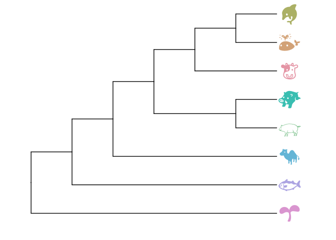
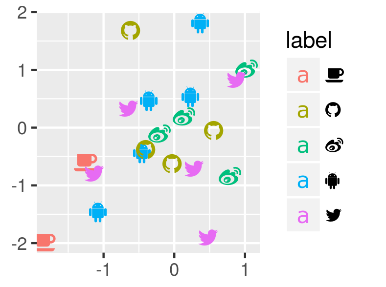

```{r style, echo=FALSE, results="asis", message=FALSE}
knitr::opts_chunk$set(tidy = FALSE,
		   message = FALSE)
```


```{r echo=FALSE, results="hide", message=FALSE}
library("ggplot2")
library("emojifont")
```

# emojifont: using emoji font in `R`

[emoGG](https://github.com/dill/emoGG/) is a good attemp to add `emoji` in `ggplot2`. It render `emoji` picture (png) and creat a layer, `geom_emoji`, to add emoji.

In my opinion, `emoji` should be treated as ordinary font in user interface, albeit it maynot be true internally.


It would be more flexible if we can use emoji as ordinary font and in this way user don't need to learn extra stuff.


The `emojifont` package is designed to bring `emoji` font to R users and is created for users that are impatient and relutant to learn. 

The package is very simple, pack some emoji fonts (currently only [OpenSansEmoji.ttf](https://github.com/MorbZ/OpenSansEmoji)) and use [showtext](https://github.com/yixuan/showtext) to render the fonts, then we can use the font in either base plot or ggplot2.

## Installation

```r
devtools::install_github("GuangchuangYu/emojifont")
```


# Emoji characters

To use `emoji`, we need to use their corresponding unicode. Emoji unicode can be found in [http://apps.timwhitlock.info/emoji/tables/unicode](http://apps.timwhitlock.info/emoji/tables/unicode), or searched using `search_emoji` function. The `search_emoji` function will return [emoji aliases](http://www.emoji-cheat-sheet.com/) which can be converted to unicode by `emoji` function.

```{r}
library(emojifont)

search_emoji('smile')
emoji(search_emoji('smile'))
```


# Emoji in R plot

To support using emoji in R plot, we need to load `emoji` font and then use `family` parameter to specify using the font.

## load Emoji font 
```{r}
## list available emoji fonts
list.emojifonts()

## load selected emoji font
load.emojifont('OpenSansEmoji.ttf')
```


## base plot

```r
set.seed(123)
x <- rnorm(10)
set.seed(321)
y <- rnorm(10)
plot(x, y, cex=0)
text(x, y, labels=emoji('cow'), cex=1.5, col='steelblue', family='OpenSansEmoji')
```


## ggplot2

```r
d <- data.frame(x=x, y=y,
     label = sample(c(emoji('cow'), emoji('camel')), 10, replace=TRUE),
     type = sample(LETTERS[1:3], 10, replace=TRUE))
require(ggplot2)
ggplot(d, aes(x, y, color=type, label=label)) + 
    geom_text(family="OpenSansEmoji", size=5)
```


## ggtree

```r
require(ggtree)
require(colorspace)

tree_text=paste0(
    "(","(","(",
       "(",
            "(",
               emoji("cow"), ",",
               "(",
                  emoji("whale"),",",
                  emoji("dolphin"),
               ")",
            "),",
            "(",
               emoji('pig2'),",",
               emoji('boar'),
            ")",
       "),",
       emoji("camel"),
    "),", emoji("fish"), "),", 
emoji("seedling"), ");")

ggtree(read.tree(text=tree_text)) + xlim(NA, 7) +
   geom_tiplab(family="OpenSansEmoji", size=10,
               color=rainbow_hcl(8))
```



# Apple Color Emoji

Although `R`'s graphical devices don't support `AppleColorEmoji` font, it's still possible to use it. We can export the `plot` to `svg` file and render it in `Safari`.

```r
library(gridSVG)
p <-  ggtree(read.tree(text=tree_text), size=2) + geom_tiplab(size=20)
p <- p %>% phylopic("79ad5f09-cf21-4c89-8e7d-0c82a00ce728", color="firebrick", alpha = .3)
p <- p + xlim(NA, 7) + ylim(NA, 8.5)
p
ps = grid.export("emoji.svg", addClass=T)
```


# Font Awesome

The `emojifont` package was initially designed for using emoji font. I found that [FontAwesome](http://fontawesome.io/cheatsheet/) is quite interesting especially in technical world.


The usage is quite similar as using emoji.

```r
load.fontawesome()

set.seed(2016-03-09)
fa <- fontawesome(c('fa-github', 'fa-weibo', 'fa-twitter', 'fa-android', 'fa-coffee'))
d <- data.frame(x=rnorm(20), 
                y=rnorm(20), 
     	        label=sample(fa, 20, replace=T))

ggplot(d, aes(x, y, color=label)) + 
   geom_text(aes(label=label), family='fontawesome-webfont')+
     xlab(NULL)+ylab(NULL)
```



# Limitation

`RStudio` using a different way to open graphics device and `showtext` is currently incompatible with it.

Since `emojifont` use `showtext` as backend to parse emoji font, it also incompatible with `RStudio`.

The solution is to manually open a window by calling `X11()` in Linux, `quartz()` in Mac or `windows()` in Windows, and create plots on top of that, instead of the built-in device offered by `RStudio`.


# Note

Currently, this package support Emoji Font and Font Awesome.

+ `OpenSansEmoji.ttf` is downloaded from <https://github.com/MorbZ/OpenSansEmoji>
+ `fontawesome-webfont.ttf` is downloaded from <https://github.com/FortAwesome/Font-Awesome>.

Feel free to fork this package to add your favorite iconic fonts.

# Bugs/Feature requests

If you have any, [let me know](https://github.com/GuangchuangYu/emojifont/issues). Thx!

# Session info

Here is the output of `sessionInfo()` on the system on which this document was compiled:
```{r echo=FALSE}
sessionInfo()
```


